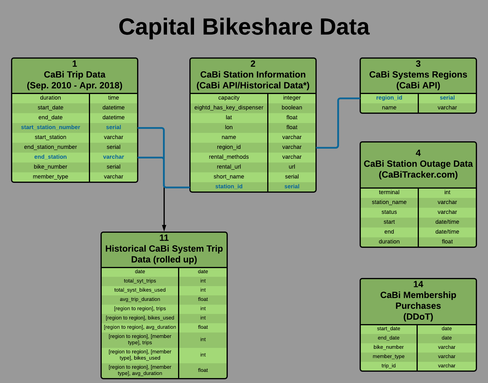
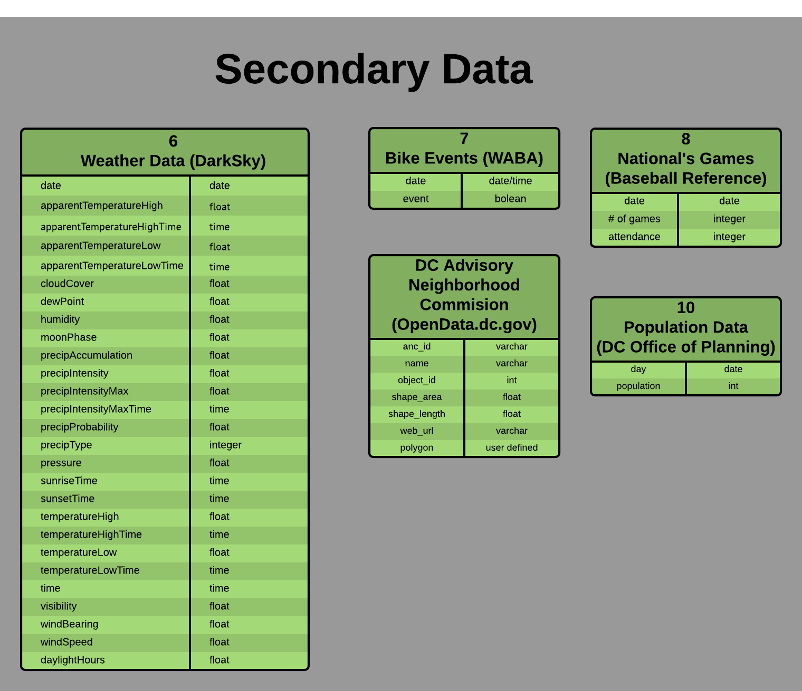
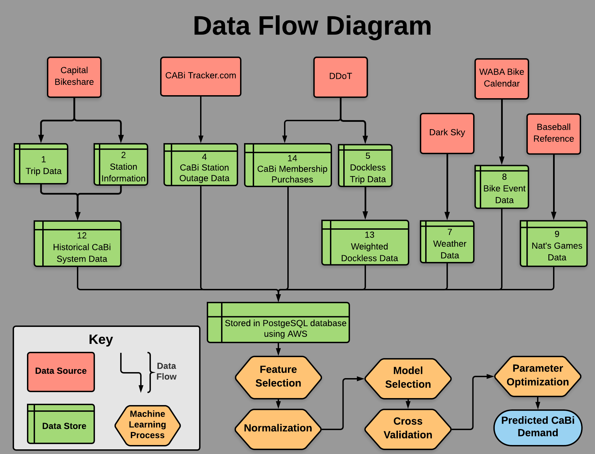
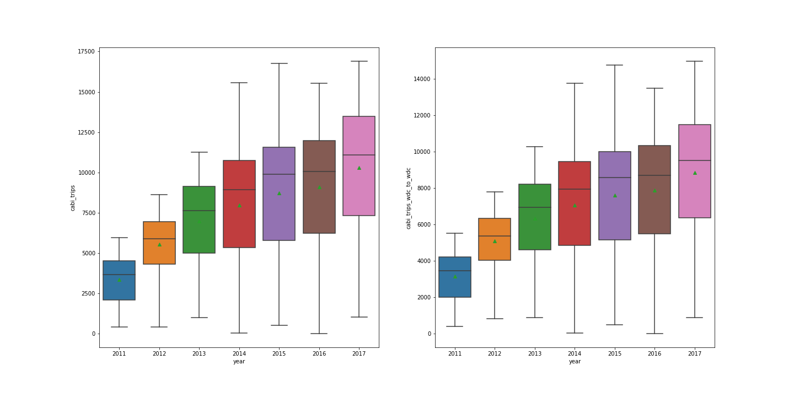
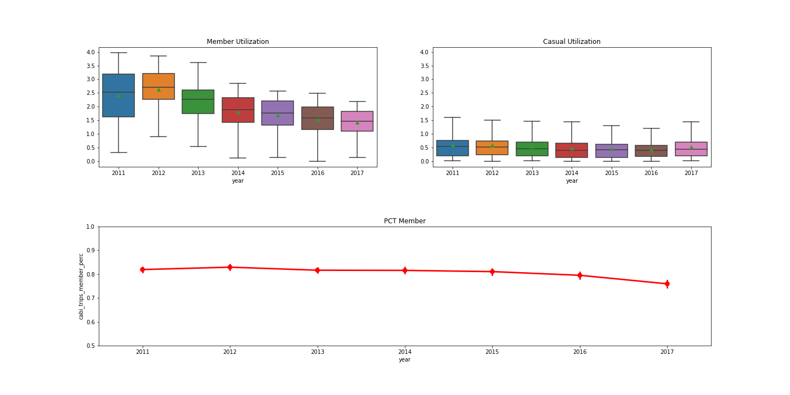
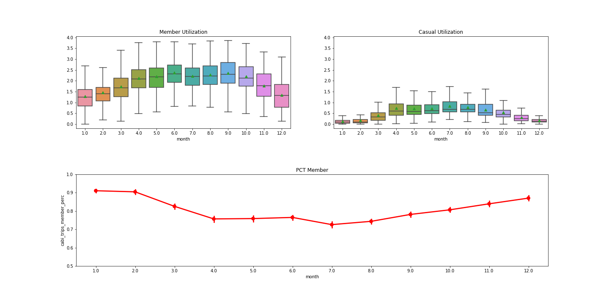
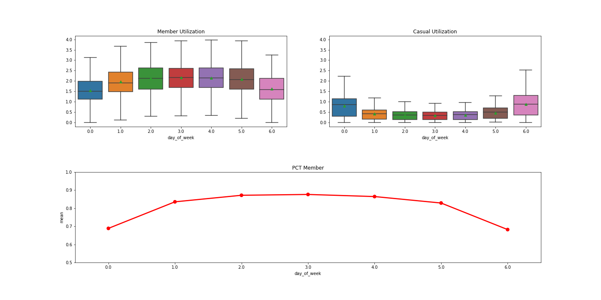

# DC-Bikeshare
Cohort 11 Capstone Project for the Certificate of Data Science at Georgetown University School of Continuing Studies.
_Sebastian Bautista, Travis Gervais, Noah Newberger, and Mark Sussman_

## README Contents
1. [Abstract](#abstract)
1. [NDA Explanation](#nda-explanation)
1. [Background Information](#background-information)
1. [Data Sourcing](#data-sourcing)
1. [Data Architecture](#data-architecture)
1. [Capital Bikeshare Exploration](#capital-bikeshare-exploration)
1. [Machine Learning](#machine-learning)
1. [Acknowledgements](#acknowledgements)

## Abstract

In September 2017, the DC Department of Transportation began a dockless bikeshare pilot program. The pilot program allowed 6 different dockless bikeshare operators to enter the DC market and begin offering their services, effectively putting them in direct competition with the 7.5 year old Capital Bikeshare system. Our project seeks to analyze the dockless pilot program to determine if the introduction of dockless bikes has impacted the demand among users for Capital Bikeshare (CaBI). We accomplish this analysis by gathering data on CaBi, the dockless bikeshare operators and external factors that we believe impact the DC bikeshare demand. Using historical data on Capital Bikeshare and the external factors we create two machine learning models using Lasso and Random Forest to predict the number of Capital Bikeshare rides that we would expect to see during the first eight months of the dockless pilot program. Then we compare our models' predicted values to the actual number of rides that occurred during the pilot program to determine if our models realistically estimated the impact that the dockless bikeshare pilot program has had an impact on Capital Bikeshare.

## NDA Explanation

Please note that in order to receive data shared with the DC Department of Transportation (DDOT) by the dockless operators participating in the dockless pilot, we as a Capstone Project team, had to sign a non-disclosure agreement with DDOT.  We have presented our finding to DDOT and agreed not to share any dockless specific analysis only in our report and presentation that can only be shared with Georgetown Data Science faculty and students and not for wider distribution.

The remainder of this README will walk through our finding that were Capital Bikeshare (CaBi) specific (i.e. stopping at our machine learning models, just before explaining the potential impact of the dockless bikeshare impact on CaBi)

## Background Information

In September 2010,  Capital Bikeshare (CaBi) began operating in the Washington, DC region with 1,100 bikes and 114 stations in Washington, DC and Arlington, VA. Since then CaBi has grown to approximately 437 stations and 4,500 bikes. It has expanded its coverage to include, Alexandria, VA, Montgomery County, MD, and Fairfax County, VA. The system, which sees an average of over 10,000 trips per day, has grown to be the third largest bikeshare system currently operating in the United States.  

In September 2017, the DC department of Transportation (DDOT) began a pilot program in Washington, DC which allowed for five dockless bikeshare companies to begin operating in the city. Dockless bikeshare bikes differ notably from CaBi in that the bikes do not need to be taken from or returned to physical docking stations. Instead, the dockless bikes can be left anywhere in the city as long as they are on public property and they are not obstructing roadways or pedestrian walkways. The lack of infrastructural prerequisites meant that seemingly overnight several fleets of brightly colored bikes appeared on the streets. Under regulations established by DDOT for the dockless bikeshare pilot program, each operator is permitted to have a maximum of 400 vehicles on the street at any given time. For the first several months of the pilot program, vehicle was synonymous with bike until electric scooters were introduced and Lime reduced the number of bikes in their fleet in order to increase the number of scooters.  The pilot program presented a unique opportunity to study the effect that the introduction of a new mode of might have on the demand for a well-established bikeshare system. In this paper we use machine learning to predict the demand for CaBi through the duration of the pilot program, and by comparing the predicted demand with the actual demand, we attempt to determine to what extent the dockless bikeshare operators have been able to disrupt the status quo. 

## Data Sourcing

The data that was gathered for this project fell into one of three categories: 

1. CaBi Data - Publicly available [system data](https://s3.amazonaws.com/capitalbikeshare-data/index.html) and [API](https://gbfs.capitalbikeshare.com/gbfs/gbfs.json)

2. Dockless Bikeshare Data - Data provided by DDOT and API
3. Misc Data - Data on a variety of factors, such as weather and population, that we believe would have an impact on the demand for bikeshares in Washington, DC. 

Most of the data that was used for this project is publicly available data which we either downloaded, scraped or used an API to pull down from a website. Exceptionally, we received dockless trip data from DDOT and dockless bikes available data from [Daniel Schep](https://schep.me/) who had already put together a site to track all the bikeshare systems in DC.  He was kind enough to share his stored API data with us so that we could actually analyze dockless bikeshare utilization rates, as the data we received from the operators was not reliable.  As we began sourcing our data, we set up a meeting with DDOT to explain to them the goals and scope of our project and offer our assistance to help analyze the efficacy of the pilot program.  DDOT  agreed to share the data that they had with us on the condition that we share our findings with them at the end of our analysis and we sign a nondisclosure agreement agreeing not to divulge any of the dockless data to the general public.
Under the rules of the pilot program, the dockless bikeshare operators are required to self-report data on a monthly basis to DDOT. The monthly reports include data on trip start and stop times, trip start and stop locations, and user id among other fields. The CSVs that we received required a significant amount of processing. For example, not every operator reported latitude and longitude trips starts/ends to the enough precision to determine actual location, which impacted our ability to compare trip locations across operators.  There were also inconsistencies with the start and end times for trips in the data that the dockless operators were self-reporting. In one extreme case it was discovered that the hours were missing from the timestamps for all trips for a particular operator. In another case, there were instances where the reported end time occurred before the reported start time which resulted in calculations for negative trip durations. 
Table descriptions and data dictionaries of all the data sources we used as can be found in our Github repo’s [data dictionary](https://github.com/georgetown-analytics/DC-Bikeshare/blob/master/DICTIONARY.md).

## Data Architecture

**Diagram 1:** Capital Bikeshare Data Flow

**Diagram 2:** Dockless Bikeshare Data Flow

**Diagram 3:** Secondary Data Flow

**Diagram 4:** Data Science

## Capital Bikeshare Exploration

We began our exploratory analysis by looking at the growth in the CaBi daily trips for from 2011 through 2017. Our goal was to determine the best time frame for our machine learning analysis by identifying when CaBi became well established in Washington, DC. Figure 1 shows that the number of trips per day increased fairly rapidly during the first three to four years of operation. During that time,  X new docking stations were added to the system. Beginning in 2014, the average number of trips taken each day has increased a slower rate, suggesting that the rapid expansion of the earlier years has ended as CaBi has become a fixture within DC’s public transportation system. 

**Figure 1:** Average daily CaBi Trips by Year (Left: System Wide, Right: DC to DC trips)

We also wanted to determine if behavior differed between the two user categories, member and casual. Members are defined as CaBi users that have purchased either an annual or monthly membership. Casual users are defined as users that have purchased a three-day, 24-hour pass or single trip pass (starting in June 2016). We examined the behavior of these two user types by plotting the bike utilization rate for members and casual users by year, month and day of the week in order to determine if there were significant differences in the usage patterns between these two groups. The bike utilization rate is defined as \frac{Total number of trips per day}{Total number of available bikes}.  In Figure 2, we examine the average bike utilization rate by year by creating one subplot which shows the bike utilization rate for members and another subplot for the bike utilization rate of casual riders. In 2011, CaBi members accounted for a little under 2.5 rides per day for each active bike. That number grew to around 2.6 rides per day in 2012 before it slowly started declining to a little over 1.5 in 2017. What this shows is that by 2011 there was already a strong demand among members when CaBi had a relatively small fleet. CaBi has added bikes to their fleet over the years at a rate which has outpaced the growth in rides per day by CaBi members. The bike utilization rate for casual users has remained fairly constant since 2011. The third subplot in Figure 2 shows that from 2011 until 2016 around 80% of CaBi’s usage is coming from members. This percentage begins to dip in 2016 and 2017; one possible explanation being that CaBi introduced $2 single trip 30 minute rides in [June 2016](https://ggwash.org/view/41888/2-will-now-buy-you-a-capital-bikeshare-trip). This makes it easier for casual users to use CaBi, as they no longer need to purchase a 24-hour or 3 day pass.

**Figure 2:** Bike Utilization Rate for CaBi by Year

Figure 3 shows the bike utilization rate by month for the two user types. The subplots clearly demonstrate the seasonality of usage for both members and casual users. For both user types, the utilization rate of the bikes is depressed during the colder winter months and peaks in the warmer summer months. However, the drop off in the utilization rate during the winter months for casual users is more substantial than it is for members. Members account for around 90% of trips during the months of December, January, and February, as seen in the third subplot of figure 3. However, that rate falls to a little over 75% in the summer months once the usage among casual riders begins to increase, starting around March. It’s important to note that our analysis of the dockless pilot program does not include the summer months since it began in September and has only been running for the past 9.5 months.

**Figure 3:** Bike Utilization Rate for CaBi by Month

Figure 4 shows the bike utilization rate for members and casual users by day of the week. The subplots show that there is a difference in the usage patterns of members and casual users. For members the bike utilization rate is highest on weekdays and lower on the weekends, suggesting that CaBi members may be using the bikes to commute to and from work. For casual users, the bike utilization rate peaks on the weekends and is significantly lower during the week. It is possible that some of the casual users are people coming to DC for tourism and purchasing one of the passes that CaBi offers or DC residents engage in non-habitual usage in their leisure time. The third subplot shows that trips taken by CaBi members account for about 85% of bike usage during the work week, while during the weekend that rate drops to less than 70%. Figures 3 and 4 suggest that usage patterns differ in a significant way between members and casual users.

**Figure 4**: CaBi Bike Utilization Rate by Day of Week

## Machine Learning

## Acknowledgements

We'd like to thank Stefanie Brodie, Kim Lucas, and Jonathan Rodgers at the District Department of Transportation for sharing their dockless pilot and Capital Bikeshare data and domain expertise with us.  We'd also like to thank Daniel Schep for sharing his dockless API data with us.  Without his visionary software engineering, we wouldn't have been able to compare CaBi utilization rates with those of the dockless operators.