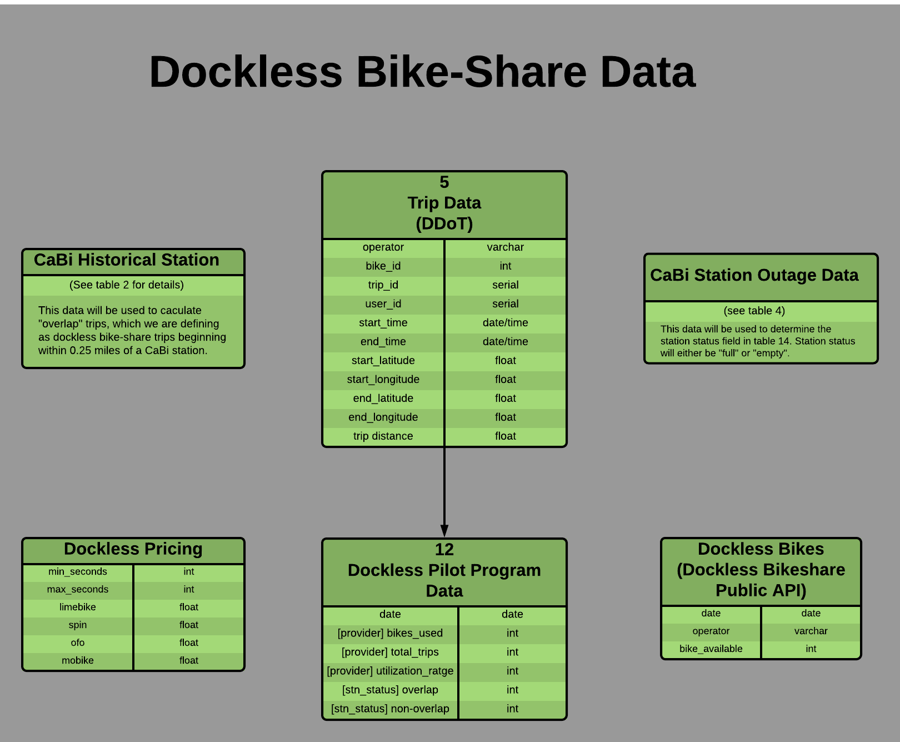

# DC-Bikeshare
Cohort 11 Capstone Project for the Certificate of Data Science at Georgetown University School of Continuing Studies.
_Sebastian Bautista, Travis Gervais, Noah Newberger, and Mark Sussman_

## README Contents
1. [Abstract](#Abstract)
1. [NDA Explanation](#NDA-Explanation)
1. [Background Information](#Background-Information)
1. [Data Architecture](#Data-Architecture)
1. [Capital Bikeshare Exploration](#Capital-Bikeshare-Exploration)
1. [Machine Learning](#Machine-Learning)

## Abstract

In September 2017, the DC Department of Transportation began a dockless bikeshare pilot program. The pilot program allowed 6 different dockless bikeshare operators to enter the DC market and begin offering their services, effectively putting them in direct competition with the 7.5 year old Capital Bikeshare system. Our project seeks to analyze the dockless pilot program to determine if the introduction of dockless bikes has impacted the demand among users for Capital Bikeshare (CaBI). We accomplish this analysis by gathering data on CaBi, the dockless bikeshare operators and external factors that we believe impact the DC bikeshare demand. Using historical data on Capital Bikeshare and the external factors we create two machine learning models using Lasso and Random Forest to predict the number of Capital Bikeshare rides that we would expect to see during the first eight months of the dockless pilot program. Then we compare our models' predicted values to the actual number of rides that occurred during the pilot program to determine if our models realistically estimated the impact that the dockless bikeshare pilot program has had an impact on Capital Bikeshare.

## NDA Explanation

Please note that in order to receive data shared with the DC Department of Transportation (DDOT) by the dockless operators participating in the dockless pilot, we as a Capstone Project team, had to sign a non-disclosure agreement with DDOT.  We have presented our finding to DDOT and agreed not to share any dockless specific analysis only in our report and presentation that can only be shared with Georgetown Data Science faculty and students and not for wider distribution.

The remainder of this README will walk through our finding that were Capital Bikeshare (CaBi) specific (i.e. stopping at our machine learning models, just before explaining the potential impact of the dockless bikeshare impact on CaBi)

## Background Information

## Data Architecture

## Capital Bikeshare Exploration

## Machine Learning

